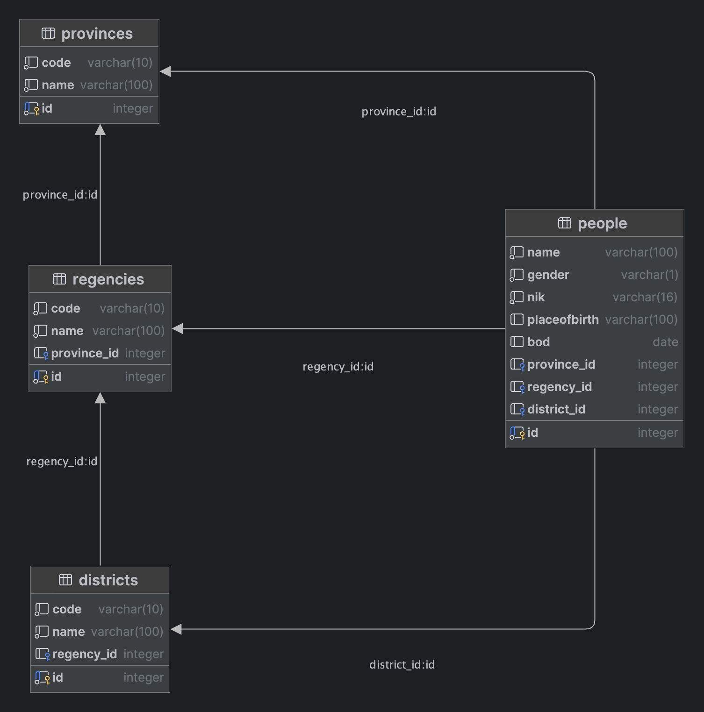

# Data Penduduk

## Schema


## Postman Collection
Download here [Data Penduduk Collection](DATA-PENDUDUK-APP.postman_collection.json)

## Run Project
### Clean Package
```bash
API_PORT=8080 DB_HOST=localhost DB_PORT=5432 DB_NAME=data_penduduk_apps DB_USERNAME=jutioncandrakirana DB_PASSWORD=P@ssw0rd DDL_AUTO=update JWT_SECRET=R4ha5iiaa!!!! JWT_EXPIRATION=1 ADMIN_USERNAME=admin ADMIN_PASSWORD=password mvn clean package
```

### Run With JAR
```bash
API_PORT=8080 DB_HOST=localhost DB_PORT=5432 DB_NAME=data_penduduk_apps DB_USERNAME=jutioncandrakirana DB_PASSWORD=P@ssw0rd DDL_AUTO=update JWT_SECRET=R4ha5iiaa!!!! JWT_EXPIRATION=1 ADMIN_USERNAME=admin ADMIN_PASSWORD=password java -jar target/springboot-data-penduduk-0.0.1-SNAPSHOT.jar
```

**Note**:
- Change all environment configurations as needed.